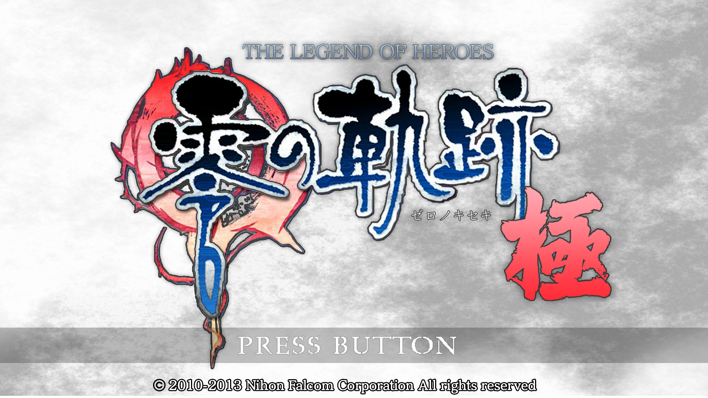
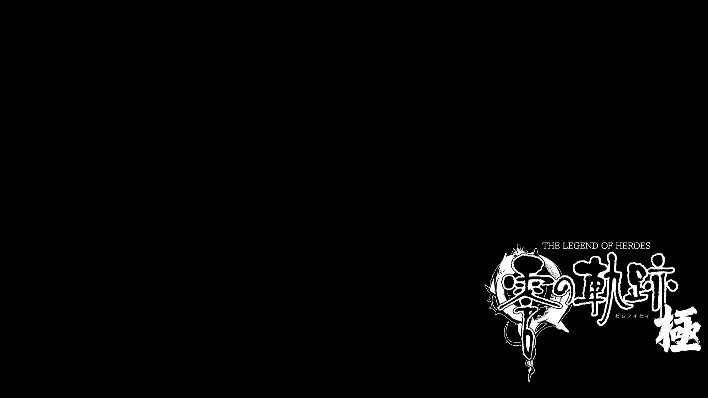
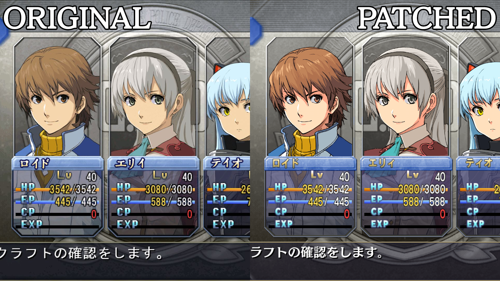
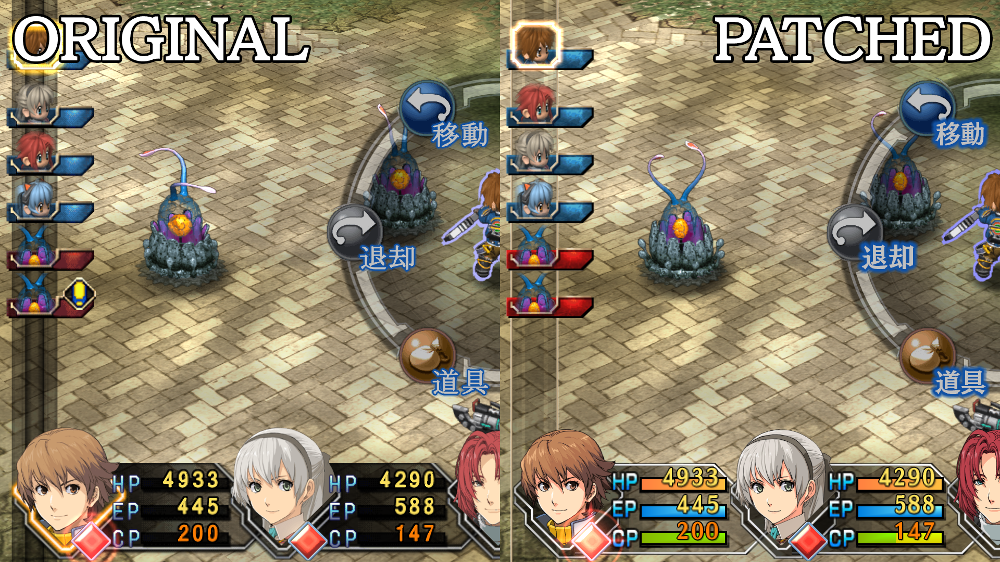
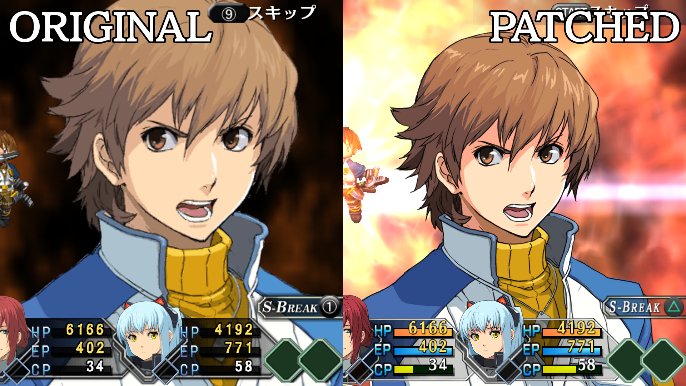
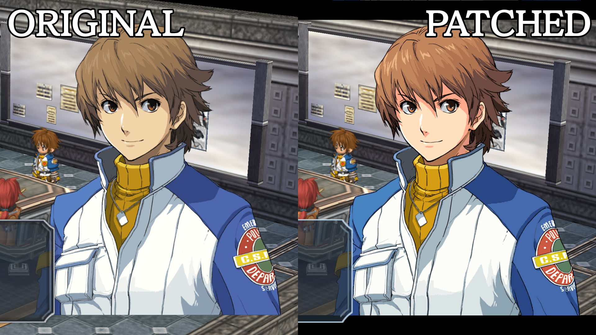
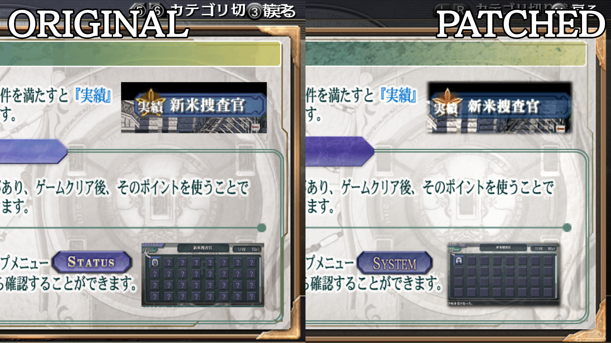
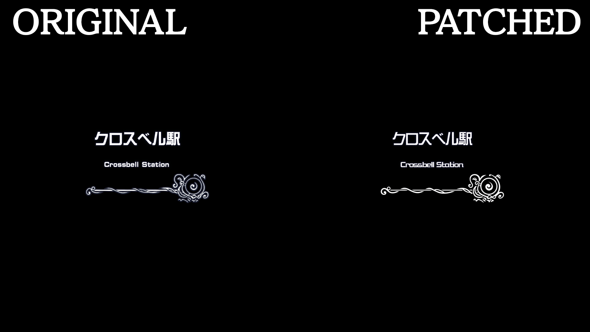

Eiyuu Densetsu -Zero no Kiseki KIWAMI-: an assets upgrade project
=========

The aim of this project was to attempt to upgrade the look of various portraits in the PC version of *The Legend of Heroes: Trails from Zero*. As many of you probably already know, Trails from Zero has been ported from PSP to PC and released in China by JOYOLAND. Long story short, in 2013 it was localized to Japanese and released with **Windows 8 support**. However, the game didn't come free of bugs and graphical issues, the most common of which was the yellowish shade all portraits features. What I tried to do was to fix this issue by porting the good assets from the *Evolution version* of the game, all the while trying to upscale them to better fit the higher resolution of the PC version. From Evolution, I also ported a few other things, which I mostly felt looked cleaner (aka, not necessarily higher resolution, but less artifacts). We'll go into details in a bit.

**EDIT (February 04, 2020)**: Now that this is out of the way, after 2 years, I'm calling this project quit. I have various reasons, one of which is the final result. As you'll read further ahead, this is hardly a perfect project, and there's a lot going on that doesn't work with the Geofront patch for many reasons. Now, the Kai versions are coming to PS4, and with even a slim chance of those being decrypted, all this work will go to waste. Will they really be decrypted? Hey, I ain't Nostradamus, sorry! I'll make this project public, and everyone will be able to do with it whatever they want. Fork it, remake it, ignore it. Do whatever you want, I have no longer any attachment to this project. I will leave beyond all the material that makes sense leaving behind, and notes about its use. I will also leave behind the initial and final release, just in case. End of the edit, you can keep reading, if you care enough to do so.

## The method

This isn't by far an original project, and thus some users may already know where I'm going with this. Believe it or not, some of the assets available in the Vita version of the game had the same resolution as the PC version. Heck, there are even assets at higher resolutions. Unfortunately though, the **dialogue portraits (and not only those) aren't part of those lucky assets**. While the PC version features 384p portraits, the Vita version runs them at 256p. In these cases, where possible, I used **Waifu2x**.

For those who don't know what that is, it's a [**Convolutional Neural Network**](https://en.wikipedia.org/wiki/Convolutional_neural_network) whose primary objective is to upscale pictures and reduce noise. Waifu2x is mainly trained to work with Anime art styles, but it can handle photos as well. Now, I can't stress this enough, but this isn't a perfect method. While it might work fine with in-game sprites, portraits with defined linearts like in our case suffer from its smoothing filter, which also causes line thinning (more or less severe depending on the chosen algorithm). The reason why this method works is because portraits are displayed at a lower resolution than what I achieved, *masking* in a sense the artifacts.

## Preparation

Before we keep talking about the project, you need to prepare your environment to accomodate the assets. So, let's see what you need, shall we?

#### 1. The Japanese PC version of The Legend of Heroes: Trails from Zero

You can purchase the game from Amazon Japan or DLSite, and you can use [this guide](https://www.reddit.com/r/Falcom/comments/7jee3m/how_to_legally_buy_zero_no_kiseki_trails_to_zero/) if you need help with that. Credits to **Luke, the Sexy Irish one** for providing us with this method.

#### 2. The Geofront Patch

This is a patch that fixes A LOOOT of issues with the vanilla version of the game, and it's the only way for my assets to work, as this adds PNG support to it. You can download the patch on [their blog](https://geofront.esterior.net/).

With the preparations out of the way, we can actually talk about the project in detail.

## The core of the project

So, as I said, the main objective is to bring the portraits up to speed, but I wanna talk a bit more in-depth about what that entails. So, let me present to you **Eiyuu Densetsu: Zero no Kiseki KIWAMI**!

Yes, I took the liberty of adapting the logo using the name of this project. A big thank you to [**Solabalossa**](https://www.youtube.com/channel/UC5F_He18MGpwZxVrsr8uZUA) who made the logo, and to **tobeavailablesoon** who worked on a few details and refinements. The result of their combined efforts is what follows. Also, the white pixels at the bottom have been fixed, it was my mistake in judging the final placement and vertical resolution of the asset.

(*The loading screen, which rarely appears but has a few chances to shine.*)

As you can see, I tried to be as consistent as I could, and made sure to not miss these details. With the presentation out of the way, it's comparisons time and I have a good example of the yellowish shade I was talking about at the beginning.

As showed, the idea is that all these kind of portraits have been fixed. This means **dialogue portraits**, **half-body portraits**, **battle portraits**, **cooking portraits**, and so on so forth. Not only that, but you probably noticed how some elements of the UI differ from the original. Those were ported from the Evolution version. Let'see a few more comparisons, just so you can have an idea of what's been changed.

(*Don't mind the missing HP/EP/CP bars, that's just me messing around with assets. It's NOT a bug of the original game.*)

As you can see, the battle portraits are much better now. To be completely fair, these weren't ported from Evolution. I instead decided to use the PC *Ao no Kiseki* ones, which are superior in any way, shape, and form. The battle menu palette is the original, but I rewrote the Kanji for each input. The style is similar to Evolution, the font is the same you can see in the camp menu, and it's the one I'm using for dialogues as well. Parameters icons on top of the characters' sprites, and the turn bonuses icons have also been changed. Mostly because they tend to have smoother edges.

(*I couldn't quite catch the exact frame, but you get the idea.*)

This treatment has also been reserved for Rushes and Conbi-Crafts.

(*Again, don't mind the missing black bars in the original.*)

I guess this is proof enough, as the most obvious issues have been fixed. I didn't showcase a few sets of portraits, but they mostly share their resolution with those I left here, so you can guess the final result.

All of these have been imported from Evolution.

**NOTE:** This one is important. I chose this comparison to show you how they messed up in the original assets. They're telling you that to check the achievements, you'll have to navigate to the *Status Menu > Record*. But you all know Record is under **System**, which I went out of my way and fixed.

This one wasn't exactly necessary. They both share the same resolution (even though the Evolution one is cleaner), and in-game they wouldn't look that much different, specially without a side-by-side comparison. The reason for this one is that I'll be going to work on Ao no Kiseki as well, and unfortunately the PC version has these in Chinese. For consistency, I decided to grab the Evolution ones for Zero no Kiseki as well.

All the portraits I mentioned have been doubled (some even quadrupled) in terms of resolution. Unfortunately, as I mentioned at the beginning, the PC version came out with many bugs and also kept the limitations the PSP version had. Leaving aside the general squared 2048p resolution cap, there were several lower caps in many regions of the game, so just upscaling the portraits would make the game crash. The Geofront programmers had to hack into the original code, and thus these limitations were removed completely. Another good thing about this fix can be seen in terms of FMVs. While I do prefer to keep the original opening of the game, the other FMVs have been encoded at higher resolution in the Vita version (double than PSP and PC). So, excluding the OP and ED if you prefer the originals, you can now use the Evolution FMVs.

## Final notes (February 04, 2020)

So, what needs attention?

#### 1. Battle UI

Files inside `battle/itp` need to be checked, specially **battle.png**. There's clipping going on, both on top of the AT Bar and bottom right where the back row characters are. The content of `effect/texture` is mostly irrelevant, but notice how the half-bosy portraits are at 512p, vastly different from the entire logic of this project. Deal is, those are used both for S-Crafts, Conbi-Crafts, and Rushes. While S-Crafts work properly, the game can't be arsed to adapt them to their Conbi-Crafts/Rushes canvases.

#### 2. Camp Menu

The stuff in `etc` is, once again, partly irrelevant and completely up to the users if they wanna use them or not. However, **c_icon1.png** and **c_icon2.png** suffer of the same clipping I mentioned before. The Orbment menu is a good example, and that requires a lot of tinkering with the PNG (or just keep the original). The entire content of the notebook also needs to be slightly fixed, as the Geofront patch replaced the button prompts based on the chosen controller, and this setting also affects all **c_notesxx.png** files. This must be done in either case, being that you use the originals or EVOs.

#### 3. Dialogues and Visuals

The folders I didn't mention are entirely up to the users, so let's move on to the final stretch. The content of the `face` folder is possibly the part I hate the most. Recently I had to fix the poor cleaning of all Randy's portraits, on top of trying to fix KeA's ones. Since I don't know if people like them I decided to keep the EVO ones, and I made an archive which uses the Ao portraits that were edited manually. This was done because the halo around her Ao portraits wasn't as clean as I thought, contrarily to what someone could think. 8bits my dudes, that's all you get, and that's all Ao no Kiseki offers. These edited portraits are inside the **Attempted_KeA_Portraits_Fix(Azure_base).zip** archive, and won't be inside the initial release. If you want them, clone the project and decide for yourselves. However, as this fix has happened literally last week, it's not complete. The `visual/bu01101.png` file also needs to be edited for consistency, so it's up to you if you wanna keep the archive, or discard it altogether. Again, most of `visual` is irrelevant to you users, it was mostly my desire. However, `visual/ex_keaxx.png` are also back to their native resolution. Like the S-Craft portraits, these are her **Extra Menu** portraits. The game can't be arsed to cache them, so higher resolutions files cause a huge performance tank. Smart move to have voice files and 4 portraits load every single time in a **scrolling** menu. Who even programmed the base game?

#### 4. Ao no Kiseki

**Ao_no_Kiseki(Battle portraits)** exists because I thought I could make the Japanese version has I had envisioned it, and Ao no Kiseki would've been the next step. While making the Zero no Kiseki ones, I went the extra mile and made those as well. I'm leaving them here, for reasons, because I had the Ao folder ready but it's just a waste of space, so I merged them.

## Installation process (February 04, 2020)

A release will come fairly soon. It depends on my upload speed, which is nothing to brag about. It'll be my initial and final release, I'm not gonna accept PRs. Once in your hands, you can do whatever you want with them, even tell people they're actually of your own making. With that said, remember that will this project is now public, you **WILL** need the Geofront patch linked above.

You can download the archive from the [Releases](https://github.com/RaienryuuNoNatsu/The-Legend-of-Heroes--Trails-from-Zero-Assets/releases) page(once available). At this point, the content as is will be in PNG, which doesn't work with the game as it looks for ITPs instead. The reason I'm leaving them as PNGs is so you can choose what to keep and what to drop. Once you're done deciding, just hit the **Convert.bat** which will simply change the files extension. Now, drag & drop the entire `data` folder in the main game's directory.